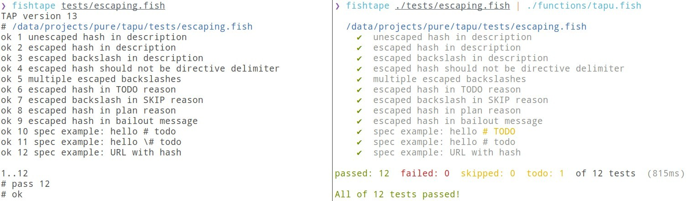

# tapu

> A TAP reporter port on [tap-diff](https://github.com/axross/tap-diff).
>
> Fully written in fish and **fully compliant** with [TAP version 14 specification][specs].

From [Maori _tapu_][def] meaning _holy_ or _taboo_ (depending on your preference).



## Features

- **Full TAP14 Compliance**: Implements all required features of the TAP version 14 specification
  - Proper escaping (`\#` and `\\`) in descriptions, directives, and messages
  - Subtest support with 4-space indentation and correlated test points
  - Plan validation (position, count matching, test ID ranges)
  - TODO/SKIP directives with case-insensitive parsing
  - YAML diagnostics with multiple field name conventions
  - Bail out support with immediate termination
- **Clean Output**: Color-coded test results with symbols (✔/✖)
- **Detailed Diagnostics**: YAML block parsing with pretty-printed failure details
- **No Dependencies**: Pure Fish implementation
- Easy integration with fish shell test suites ;
- Compatible with [fishtape](https://github.com/jorgebucaran/fishtape) test framework.

See [COMPLIANCE.md](COMPLIANCE.md) for detailed specification compliance information.

## Installation

Use [fisher][fisher] to install:

```fish
fisher install pure-fish/tapu
```

## Usage

Pipe the output of your TAP-compliant test suite to `tapu`:

```fish
fishtape tests/*.fish | tapu
```

## Development

### Running Tests

```fish
fishtape tests/*.fish
```

## [MIT](LICENSE) License

[specs]: https://testanything.org/tap-version-14-specification.html
[fisher]: https://github.com/jorgebucaran/fisher
[def]: https://en.wiktionary.org/wiki/tapu#Maori
